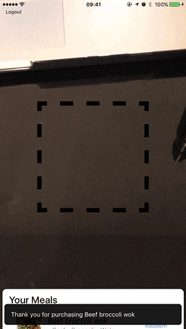

> An application to exchange food coins. This can be a beneficial way of giving support to those in need.

You can access the demo using Ionic View App. Use the following ```appId``` to view. ```417eb0b9```.
Ionic View App [Android](https://play.google.com/store/apps/details?id=com.ionicframework.view) and [iOS](https://itunes.apple.com/us/app/ionic-view-test-share-ionic-apps/id1271789931)
## Gifs of flows




## Developer Information

*This template does not work on its own*. The shared files for each starter are found in the [ionic2-app-base repo](https://github.com/ionic-team/ionic2-app-base).

To use this template, either create a new ionic project using the ionic node.js utility, or copy the files from this repository into the [Starter App Base](https://github.com/ionic-team/ionic2-app-base).

### Componenets and services in this project

### Pre-requisites:

```bash
$ sudo npm install -g ionic cordova
$ git clone git@github.com:muhammaddadu/food-coin-app.git
$ cd food-coin-app
```

### Running

```bash
$ ionic cordova run ios --device
$ // you can have a liveview for development using the following comand
$ ionic cordova run ios --device --livereload
```

Substitute ios for android if not on a Mac.

This application will need to be built on device due to the dependency of camera
